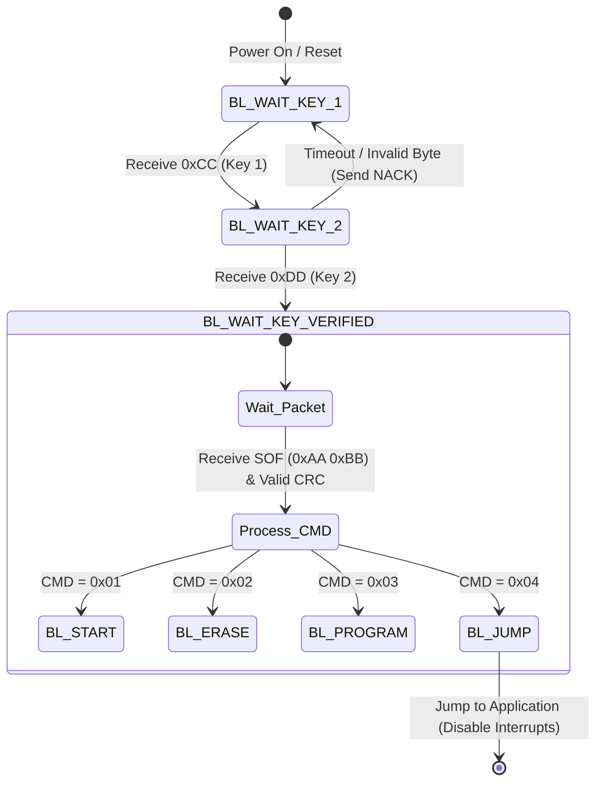

# ESP32 to STM32 Dual-MCU OTA Update System

A robust, bare-metal dual-MCU Firmware Update Over-The-Air (OTA) system. This project utilizes an ESP32 as a network-connected gateway that fetches firmware binaries from a GitHub repository via HTTPS and flashes them onto an STM32F103C8T6 host microcontroller via a custom UART bootloader protocol.

## 1. Project Overview

This system provides a reliable, remote firmware deployment pipeline for distributed edge devices. The architecture separates the network gateway layer from the core application execution layer:

* **ESP32 (Gateway):** Periodically polls GitHub using HTTP/HTTPS HEAD requests, monitors the `ETag` header for remote binary changes, streams chunks of the binary over SSL, and acts as the UART Master to flash the host.
* **STM32F103 (Application Host):** Runs a custom Bare-Metal Bootloader that verifies connection handshakes, erases designated flash memory pages, performs 16-bit CRC checks on incoming packets, programs its own internal flash, and jumps safely between the Bootloader and Application spaces.

## 2. Key Features & Implementation Achievements

* **Dynamic Update Detection:** Uses HTTP `ETag` tracking instead of downloading the entire file to check for updates, minimizing bandwidth consumption.
* **Cache-Busting Mechanism:** Implements a random `cache buster` parameter appended to URLs to bypass intermediate proxy caches and ensure fresh fetches.
* **Bare-Metal Reliability:** The STM32 bootloader is built entirely using direct register access (No HAL, No LL), ensuring minimum footprint and deterministic execution.
* **Memory-Safe Padding:** Automates 128-byte alignment padding (`0xFF`) for partial flash blocks at the end of binary streams.
* **Visual Status Indicators:** On-board LEDs accurately represent system states (New Version Available, Data Transfer/Loading).

## 3. Hardware Interconnection & Pinout

### 3.1 Wiring Schematic


### 3.2 ESP32 Peripherals

* `GPIO 0`: Push Button (Active-Low with software debounce) to trigger manual update installation.
* `GPIO 4`: `LED_NEW_VERSION` (Indicator for remote updates discovered).
* `GPIO 2`: `LED_LOADING` (Indicator for active erasing/programming).

### 3.3 STM32 Peripherals

* `PA0`: Boot-pin Override Check (If high on reset, forces an instant jump to Application).

## 4. System Architecture & Flow

### 4.1 Update Detection & Download Sequence
The following sequence describes how a firmware update is recognized, fetched, and installed:

1. **Polling:** ESP32 periodically queries the GitHub URL via `http_get_etag()`.
2. **Comparison:** If the fetched `ETag` matches `last_applied_etag`, the device remains idle. If different, `LED_NEW_VERSION` is driven high.
3. **User Trigger:** When the button on the ESP32 is pressed, the custom UART Bootloader protocol sequence initiates.

### 4.2 UART Frame Protocol Definition
All packets transmitted from the ESP32 to the STM32 follow a rigid serialization format:

| Field | Size (Bytes) | Value / Description |
| :--- | :--- | :--- |
| **Start of Frame (SOF)** | 2 | `0xAA 0xBB` |
| **Command Code (CMD)** | 1 | `BL_START`, `BL_ERASE`, `BL_PROGRAM`, or `BL_JUMP` |
| **Data Length** | 1 | Number of data payload bytes (Length <= 250) |
| **Payload Data** | Variable | Raw binary payload content |
| **Checksum (CRC16)** | 2 | Big-Endian CCITT CRC-16 ($x^{16} + x^{12} + x^5 + 1$) |


## 5. Software State Machines


### 5.1 STM32 Bootloader Security Handshake

Before accepting commands, the STM32 bootloader strictly validates a two-step handshake sequence inside its main execution loop.

### 5.2 Bootloader Packet Execution Flow

Once verified, the STM32 operates based on commands embedded in the validated data frames:

* **`BL_START`**: Sets internal flash write pointer (`FLASH_Page_Pointer`) to `APP_ADD_BASE`. Returns `BL_ACK`.
* **`BL_ERASE`**: Reads the target page count from the payload and clears sector ranges sequentially. Returns `BL_ACK`.
* **`BL_PROGRAM`**: Assembles 8-bit streams into 16-bit half-words and writes sequentially to internal Flash. Returns `BL_ACK`.
* **`BL_JUMP`**: Disables global interrupts, clears the SysTick timer, re-maps the Vector Table Base Register (`SCB_VTOR`), resets the Main Stack Pointer (`_Set_MSP`), and triggers the Reset Handler function pointer of the user application.

## 6. Flash Memory Mapping (STM32F103C8T6)

The internal 64KB Flash memory configuration is mapped out as follows:

## 7. Build and Flash Instructions

### Prerequisites
* **ESP32:** ESP-IDF framework (v5.x recommended) or VS Code ESP-IDF extension.
* **STM32:** `arm-none-eabi-gcc` toolchain and an ST-Link V2 programmer.

### Step 1: Flash the STM32 Bootloader
Navigate into your STM32 workspace directory and build/flash the code:
```bash
make clean && make
st-flash write build/stm32_bootloader.bin 0x08000000
