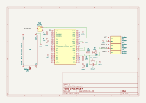
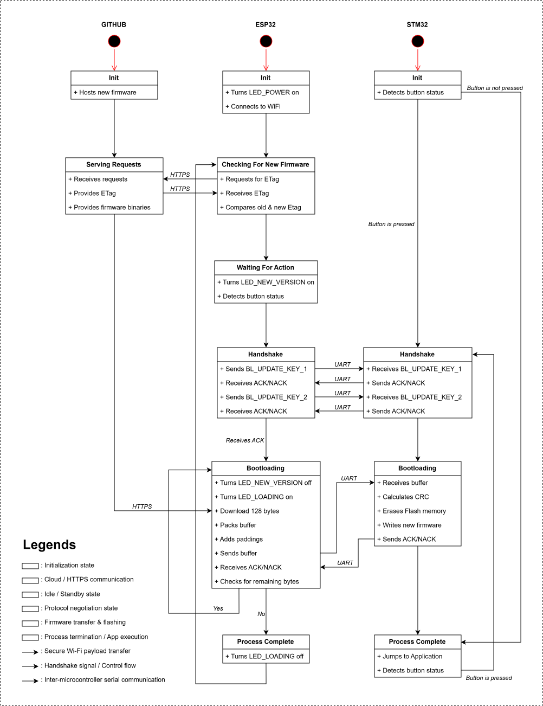
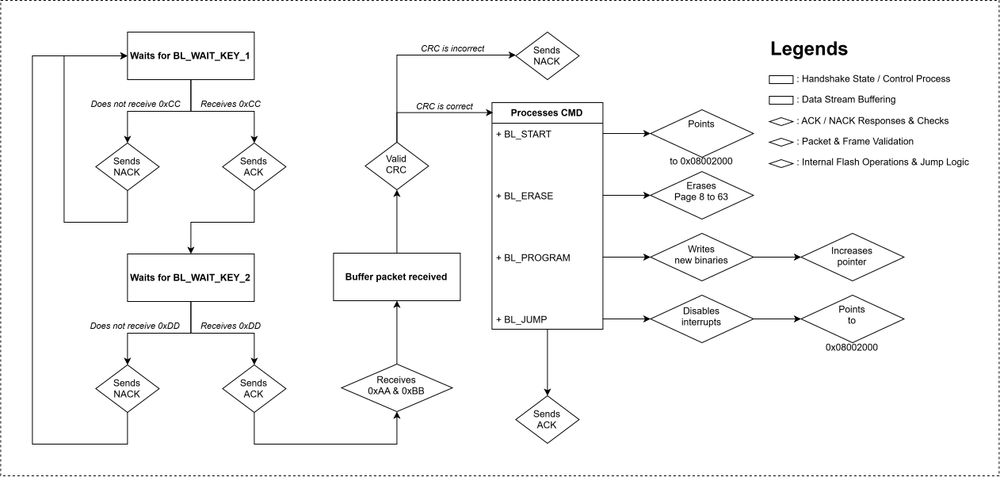
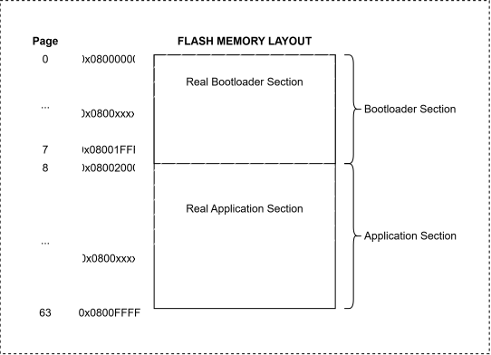

# ESP32 to STM32 Dual-MCU OTA Update System

A robust dual-MCU Firmware Over-The-Air (OTA) update system. This project utilizes an ESP32 as a network-connected gateway that fetches firmware binaries from a GitHub repository via HTTPS and flashes them onto an STM32F103C8T6 target microcontroller via a custom bare-metal UART bootloader protocol.

---

## 1. Project Overview

This system provides a reliable, remote firmware deployment pipeline for distributed edge devices. The architecture clearly separates the network gateway layer from the core application execution layer:

* **ESP32 (Gateway):** Periodically polls GitHub using HTTPS HEAD requests, monitors the `ETag` header for remote binary changes, streams 128-byte chunk buffers over SSL, and acts as the UART Master to program the host.
* **STM32F103 (Application Host):** Runs a custom **Bare-Metal Bootloader** (direct register access) that verifies a 2-step handshake, erases designated internal flash pages, calculates 16-bit CRC on incoming packets, programs internal flash, and safely jumps to user application space.

---

## 2. Key Features & Implementation Achievements

* **Dynamic Update Detection:** Uses HTTP `ETag` tracking instead of full binary downloads to detect remote firmware updates, drastically reducing bandwidth and power consumption.
* **Cache-Busting Mechanism:** Appends a random `cache buster` parameter to query URLs to bypass proxy/CDN caching and guarantee fresh fetches.
* **Bare-Metal Reliability:** The STM32 bootloader is implemented entirely at the register level (No HAL, No LL, No RTOS), minimizing code footprint and eliminating library overhead.
* **Stream-Based Chunk Buffering:** Downloads and flashes firmware in 128-byte chunks, avoiding the need for large external flash/RAM storage.
* **Memory-Safe Padding:** Automates 128-byte alignment padding (`0xFF`) for non-full partial flash blocks at the end of the stream.
* **Hardware Status Indicators:** Dedicated LEDs provide real-time visual feedback (`LED_POWER`, `LED_NEW_VERSION`, `LED_LOADING`).

---

## 3. Hardware Overview & Pinout

### 3.1 Components & Modules
* **Gateway Microcontroller:** ESP32-DevKitC-32D.
* **Target Microcontroller:** STM32F103C8T6 (ARM Cortex-M3).
* **Power Management:** LM2596 Buck Converter Module (12V Battery Input → 5V System Power).
* **Power Control:** SW_SPDT Power Switch.
* **User Input:** SPST Push Button with RC filter (`C1 = 0.1µF`) for physical debouncing.

### 3.2 Pin Mapping

#### ESP32 Gateway Board:
| Pin Name | Function / Connection | Description |
| :--- | :--- | :--- |
| `IO32` | `LED_POWER` (`D1` via 220Ω) | Power-On Indicator |
| `IO17` | `LED_NEW_VERSION` (`D2` via 220Ω) | Remote update available on GitHub |
| `IO2` | `LED_LOADING` (`D3` via 220Ω) | Active flashing/erasing in progress |
| `IO4` | `SW1 Button` (Active-Low) | User trigger to start OTA update process |
| `TXD2` (`IO10`) | UART2 TX $\rightarrow$ STM32 RX | Serial Command & Payload Line |
| `RXD2` (`IO9`) | UART2 RX $\leftarrow$ STM32 TX | Serial ACK/NACK Response Line |

#### Target Communication Header (5-Pin Header):
| Pin | Function | Description |
| :--- | :--- | :--- |
| `1` | `VCC` | +5V Power Rail |
| `2` | `GND` | Ground Reference |
| `3` | `RxD` | UART Receive Line |
| `4` | `TxD` | UART Transmit Line |
| `5` | `Button` | Manual Boot Mode Trigger / Hardware Interlock |

---

## 4. Hardware Design & Schematics

### 4.1 Schematic Diagram
The custom carrier board schematic integrates power regulation, status LEDs, debounced input, and external headers.

  

### 4.2 PCB Layout
Single-sided PCB design incorporating power planes, signal routing, and modular sub-board connections.

  

---

## 5. Software Architecture & State Machines

### 5.1 System-Level Finite State Machine (End-to-End Workflow)
The complete interaction lifecycle between GitHub Cloud, ESP32 Gateway, and STM32 Target Microcontroller:

  

### 5.2 STM32 Bootloader Internal Operations
Detailed internal state processing, packet verification, and flash memory execution on the target STM32:

  

---

## 6. UART Communication Protocol

All control frames and data packets transmitted from the ESP32 to the STM32 adhere to a structured protocol format:

### 6.1 Packet Structure
| Field | Size (Bytes) | Description / Value |
| :--- | :--- | :--- |
| **Start of Frame (SOF)** | 2 | Header Sync Bytes: `0xAA 0xBB` |
| **Command Code (CMD)** | 1 | `0x01` (START), `0x02` (ERASE), `0x03` (PROGRAM), `0x04` (JUMP) |
| **Data Length** | 1 | Payload byte length ($N \le 250$) |
| **Payload Data** | $N$ | Binary firmware slice or command parameters |
| **Checksum (CRC16)** | 2 | Big-Endian CCITT CRC-16 ($x^{16} + x^{12} + x^5 + 1$) |

### 6.2 Security Handshake Sequence
Before accepting flashing commands, the STM32 enforces a strict key validation handshake:
1. ESP32 sends `BL_UPDATE_KEY_1` (`0xCC`). STM32 validates and responds with `ACK` (`0x0A`).
2. ESP32 sends `BL_UPDATE_KEY_2` (`0xDD`). STM32 validates and responds with `ACK` (`0x0A`).
3. Upon completion, STM32 transitions to the verified bootloader receiving state.

### 6.3 Flashing Commands Breakdown
* `BL_START` (`0x01`): Resets internal flash write pointer (`FLASH_Page_Pointer`) to `APP_ADD_BASE` (`0x08002000`).
* `BL_ERASE` (`0x02`): Sequentially erases target application pages (Pages 8 to 63).
* `BL_PROGRAM` (`0x03`): Programs incoming 128-byte binary streams into Flash as 16-bit half-words and increments the memory pointer.
* `BL_JUMP` (`0x04`): Disables global interrupts, re-maps Vector Table (`SCB_VTOR` to `0x08002000`), sets Main Stack Pointer (`_Set_MSP`), and jumps to User Application Execution.

---

## 7. Flash Memory Mapping (STM32F103C8T6)

The internal 64KB Flash memory space is divided to segregate the immutable bootloader from the upgradable application space:

  

## 8. Build and Flash
**ESP32 Gateway Firmware**
* **Framework: ESP-IDF / Arduino Core for ESP32.**

* **Libraries:** WiFiClientSecure, HTTPClient.

**STM32 Bootloader**
* **Toolchain:** arm-none-eabi-gcc.

* **Build System:** CMake.

* **Programmer:** ST-Link V2.

* **Development Style:** Bare-metal direct register programming (No HAL / LL libraries used).

## 9. Performance & System Trade-offs
* **Baud Rate Selection (9600 bps):** Chosen to guarantee noise-immune, zero-error serial data transfer over unshielded wires between the gateway and target board without needing hardware RTS/CTS flow control.

* **Stream Buffering vs. External Storage:** Processing firmware in small 128-byte RAM buffers eliminates the physical footprint, cost, and power overhead of an external SPI Flash chip or SD card module.

* **Single-Bank Flashing:** Prioritizes maximum flash allocation for user applications (~56KB available out of 64KB) over dual-bank storage, relying on CRC checks and handshake verification to ensure update integrity.

## 10. Limitations and Future Improvements
* **Dual-Bank Architecture:** Adding external SPI flash to support rollback in case of power interruption during programming.

* **Hardware Reset Line:** Wiring an ESP32 GPIO directly to the STM32 NRST pin for automated hard-resets into bootloader mode.

* **Firmware Encryption:** Implementing AES-128/256 payload decryption on the STM32 to secure firmware against eavesdropping.

## 11. Author
**Author:** Vo Phuc Thinh
